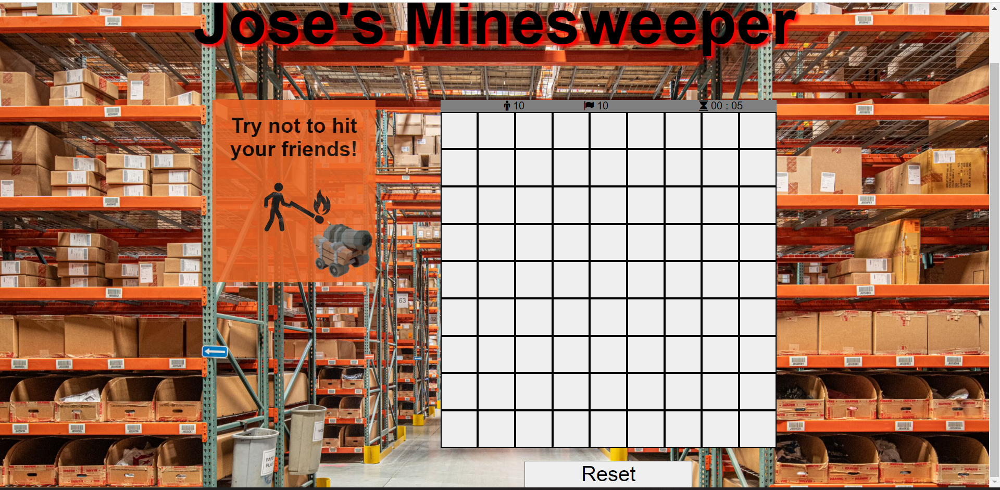
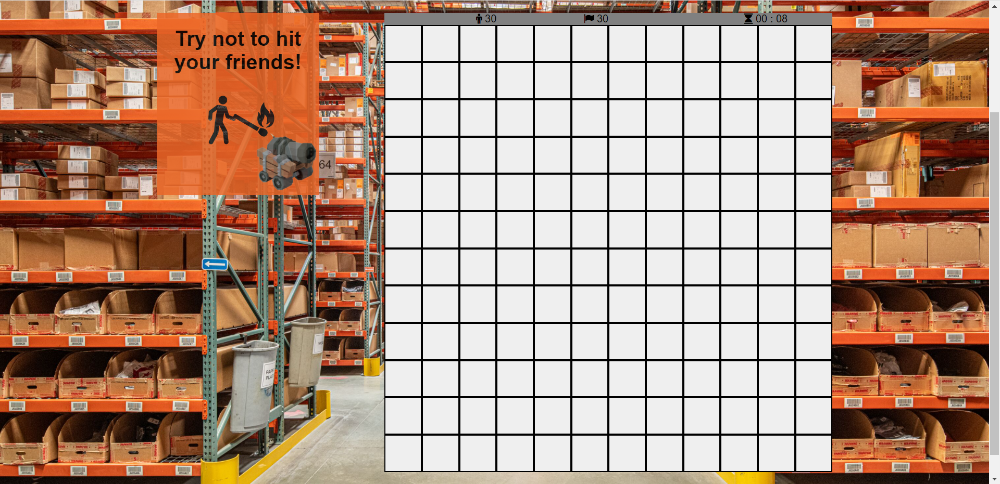

# Jose's Minesweeper
    The game originates from the 1960s, and the objective of the game is to clear a rectangular board 
    containing hidden "mines" or bombs without detonating any of them, with help from clues about the 
    number of neighbouring mines in each field. You can use flags to select squares that you deem to be 
    risky and you easily remmember that there might be a bomb in that square based on the numbers of 
    neighborign mines.

## Game Screenshots

The next screen shots show the three different Grid sizes:
Small:

Medium:

Large:

The following Screenshot is of the neighbor numbers being displayed in the game:

This is the diplay screen for the winner:

This is the diplay screen for the loser:

## Technologies Used
##### HTML:
    All of the divs and sections were hard coded into the HTML file. 
    The Div containing the game title always stays the same:
##### CSS:
    CSS was use throughtout the webpage, background images, 
    text-font and colors were all added in the css file.
##### Javascript:
    Javascript was used to collect the selected option from the user. 
    Then that choice was used to build the grid size.The javascript file 
    is the biggest of the three files as it holds all of the games functionality. 
    There are a lot of functions and variables, which link the html to the javascript 
    to be able to change or add content to the html to be visible to the user.Javascript 
    also changes the css styling by changing the html's classes or id's to different ones 
    that have been previously declared in the css file.

## Getting Started
    I recoment lowering the sound if wearing headphones.
    You play the game just like any other minesweeper game, 
    click on a square and hope it is a safe square:
##### Live Page:
https://jacastro023.github.io/Project-1-Browser-based-Game/

## Next Steps:
    * Adding a high score page
    * Adding more difficulty levels
    * Make the clicks more interactive, and animated
      show how the square opens up to show theres either nothing inside or theres a bomb inside.
    * Make the view and design more visually appealing